<h2 style="text-align:center; font-weight:normal; color:#555;">
<b>Identifying optimal trading strategies for individual stocks</b>
</h2>

### Abstract

Trading strategies generally propose a set of well defined rules that guide the market trader to perform profitable trades under appropriate assumptions. These rules include when to initiate and end the trading position, and in some cases, they may also include the quantity of stocks to be traded.

With a variety of trading strategies out there in the market, often some giving contradictory trading signals, it is important for the market trader to know which strategy works better for a particular stock. Most traders hone this knowledge via trial and error, and through experience they learn what is right and what is not. 

This project aims to enhance that learning process by applying the principles of Bayesian Statistics, thus providing a systematic framework to evaluate strategies. By doing so, it aims to offer concrete, data-driven insights that can help even novice traders make profitable trading decisions.

To better understand the project, we have divided it into three distinct sections, each describing a different Bayesian model to identify our ideal strategy. We begin by describing the dataset that shall be used throughout the analysis.

### Describing the dataset

The dataset consists of the daily closing prices of the BHARTIARTL stock over the last $2500$ trading days, contained between *1st September,2015* to *17th October,2025*. This data can be readily sourced from [Yahoo Finance](https://finance.yahoo.com/), which can be accessed in python via the **yfinance** library. 

We implement the data extraction process in [`fetch_data.py`](Stocks%20data/fetch_data.py) as given below. The dates and closing prices of the Airtel stock are saved in the csv file [`Airtel_stocks.csv`](Stocks%20data/Airtel_stocks.csv)


```python
# Stocks data/fetch_data.py
import pandas as pd
import matplotlib.pyplot as plt
import yfinance as yf
import warnings

warnings.filterwarnings('ignore')

# Download Airtel stocks for the recent 1000 days
stocks = 'BHARTIARTL.NS'
data = yf.download(stocks, period='2500d', interval='1d')

# Extract the closing prices alone. 
data = data[['Close']].copy()
data.reset_index(inplace=True)

# save the data in a new csv file 
file = 'Stocks data/Airtel_stocks.csv'
data.to_csv(file, index=False)

# ----- Debugging ----- 

# # Plotting the graphs to check if the prices are loaded correctly once
# plt.figure(figsize=(10,5))
# plt.plot(data['Date'], data['Close'])
# plt.title('Bharti Airtel Closing Prices - Last 1000 Days')
# plt.xlabel('Date')
# plt.ylabel('Close Price')
# plt.grid(True)
# plt.show()

# print(data.tail())
```

    [*********************100%***********************]  1 of 1 completed
    

### Choice of trading strategies

In the first two sections of this project, we choose to work with the following two trading strategies

1. **14-RSI + 5-RSI-EMA** strategy
2. **9-EMA + 21-EMA** crossover strategy

Detailed explanations of these strategies can be found [here](https://zerodha.com/varsity/chapter/indicators-part-1/) and [here](https://zerodha.com/varsity/chapter/indicators-part-2/). 

We compute the daily numerical values of both the indicators for our dataset in [`Compute_indicators.py`](Stocks%20data/Compute_indicators.py) as given below. The resulting values are stored in [`Airtel_indicator_values.csv`](Stocks%20data/Airtel_indicator_values.csv) for subsequent analysis.


```python
import pandas as pd
import numpy as np

data = pd.read_csv('Stocks data/Airtel_stocks.csv', parse_dates=['Date'])
data['Close'] = pd.to_numeric(data['Close'], errors='coerce') # Convert to numeric data to avoid data type mismatch
# data = data.dropna(subset=['Close']) 
# Drops nan values (not needed)
data = data[['Date', 'Close']].copy()

# Computing the (9 + 21) EMA indicator values
data['EMA9'] = data['Close'].ewm(span=9, adjust=False).mean()
data['EMA21'] = data['Close'].ewm(span=21, adjust=False).mean()

# Computing the RSI values with 14 day lookback period 
delta = data['Close'].diff()
gain = np.where(delta > 0, delta, 0)
loss = np.where(delta < 0, -delta, 0)
avg_gain = pd.Series(gain).rolling(14, min_periods=14).mean()
avg_loss = pd.Series(loss).rolling(14, min_periods=14).mean()
rs = avg_gain / avg_loss
data['RSI'] = 100 - (100 / (1 + rs))

# computing the RSI moving average with lookback period 5 
data['RSI_MA'] = data['RSI'].rolling(5, min_periods=5).mean()

# save the data
file = 'Stocks data/Airtel_indicator_values.csv'
data.to_csv(file, index=False)

# # ----- Debugging ----- 

# print(data.head())

```

## First Section - Simplified Bayesian Model

In this section, we implement a Bayesian model that allows us to find the probablity of success for both the above discussed strategies on the Airtel stock. The aim here is to maximize the number of profitable trades, and not necessarily the returns themselves.

Let $p_1$ and $p_2$ denote the probablity of success for the EMA and the RSI strategy respectively. Naturally, we consider the Beta-Binomial model, and define the priors $p_1 \sim \text{Beta}(1,1)$ and $p_2 \sim \text{Beta}(1,1)$.

This choice reflects our initial uncertainty about the strategies' efficiency, although the parameters can also be set based on historical performance.

Next, we identify **profitable days**, where the closing price exceeds the previous day's close. We then compare these with the daily signals generated by each strategy to determine how often the strategies align with the profitable movements.  

The implementation is available in [`simple_trading_model.py`](Simplified%20Model/simple_trading_model.py), with the snippet below showing the part relevant to our discussion.


```python
# Simplified Model/simple_trading_model.py
import pandas as pd
import numpy as np
import matplotlib.pyplot as plt

# Load the indicator data
data = pd.read_csv('Stocks Data/Airtel_indicator_values.csv', index_col=0, parse_dates=True)

# Initially we let both priors be uniform(0, 1) or beta(1, 1)
prior = {
    'EMA_Crossover': {'alpha': 1, 'beta': 1},
    'RSI_Strategy': {'alpha': 1, 'beta': 1}
}

# Defining the rules for each trading strategy
data['EMA_signal'] = np.where(data['EMA9'] > data['EMA21'], 1, 0)
data['RSI_signal'] = np.where(data['RSI'] < data['RSI_MA'], 1, 0)

# Calculate next-day profit based on the trading signals
data['Close_next'] = data['Close'].shift(-1)
data['EMA_profit_actual'] = np.where((data['EMA_signal'] == 1) & (data['Close_next'] > data['Close']), 1, 0)
data['RSI_profit_actual'] = np.where((data['RSI_signal'] == 1) & (data['Close_next'] > data['Close']), 1, 0)
data = data[:-1]

```

### Bayesian updating of trading strategies

To update our understanding of the success probabilities $p_1$ (EMA crossover) and $p_2$ (RSI strategy), we simulate a sequence of $n$ trades for each strategy independently. We track the fraction of profitable trades, denoted by $y_1$ and $y_2$, to sequentially update the respective priors.  

**Note:** A "trade" does not necessarily mean buying or selling a stock, it may also indicate maintaining the current position. By $n$ trades, we refer to $n$ decision points where a trading action is considered.

We use closing prices from day 100 to day 1999 to perform sequential updates of the priors. For flexibility, this 1900-day period is divided into equal-sized batches, with equally spaced trades in each batch. In this analysis:  

- **Batch size:** 50 days  
- **Trades per batch:** 20 approx (roughly one trade every 2–3 days)  

For each batch, we compute:

- The fraction of profitable trades $y_1$ and $y_2$  
- The posterior means for each strategy  

All these results are stored in the CSV file [`results.csv`](Simplified%20Model/results.csv) for further analysis.


```python
# Simplified Model/simple_training_model.py
train_data = data.iloc[100:2000].copy()

# Hyperparameters
interval_size = 50
trades = 20
results = []
rsi_win = 0
ema_win = 0
tie = 0

num_intervals = len(train_data) // interval_size

for idx in range(num_intervals):
    start = idx * interval_size
    end = start + interval_size
    interval_data = train_data.iloc[start:end]

    # Equally spaced trade indices in this interval
    step = len(interval_data) // trades
    trade_indices = np.arange(0, len(interval_data), step)[:trades]

    # Subset of trades that are profitable
    ema_signal_data = interval_data.iloc[trade_indices][interval_data.iloc[trade_indices]['EMA_signal'] == 1]
    rsi_signal_data = interval_data.iloc[trade_indices][interval_data.iloc[trade_indices]['RSI_signal'] == 1]

    # Count successes and total signals
    ema_success = ema_signal_data['EMA_profit_actual'].sum()
    rsi_success = rsi_signal_data['RSI_profit_actual'].sum()
    ema_total = len(ema_signal_data)
    rsi_total = len(rsi_signal_data)

    # Compute success rates (avoid division by zero)
    ema_rate = ema_success / ema_total if ema_total > 0 else 0
    rsi_rate = rsi_success / rsi_total if rsi_total > 0 else 0

    # Update priors
    ema_fail = ema_total - ema_success
    rsi_fail = rsi_total - rsi_success
    prior['EMA_Crossover']['alpha'] += ema_success
    prior['EMA_Crossover']['beta'] += ema_fail
    prior['RSI_Strategy']['alpha'] += rsi_success
    prior['RSI_Strategy']['beta'] += rsi_fail

    # Posterior means after this interval
    posterior_means = {
        'EMA_Crossover': prior['EMA_Crossover']['alpha'] / (prior['EMA_Crossover']['alpha'] + prior['EMA_Crossover']['beta']),
        'RSI_Strategy': prior['RSI_Strategy']['alpha'] / (prior['RSI_Strategy']['alpha'] + prior['RSI_Strategy']['beta'])
    }

    if rsi_rate > ema_rate:
        rsi_win += 1
    elif ema_rate > rsi_rate:
        ema_win += 1
    else:
        tie += 1

    results.append({
        'Interval': idx,
        'EMA_success_rate': ema_rate,
        'RSI_success_rate': rsi_rate,
        'EMA_alpha': prior['EMA_Crossover']['alpha'],
        'EMA_beta': prior['EMA_Crossover']['beta'],
        'RSI_alpha': prior['RSI_Strategy']['alpha'],
        'RSI_beta': prior['RSI_Strategy']['beta'],
        'EMA_posterior': posterior_means['EMA_Crossover'],
        'RSI_posterior': posterior_means['RSI_Strategy'],
    })

# Save results to csv file 
results_df = pd.DataFrame(results)
results_df.to_csv('Simplified Model/results.csv', index=False)

```

### Summary

We summarize the results of the sequential Bayesian updating over batches of trades. For each batch, we identify which strategy performed better by comparing the number of profitable trades.

From the analysis, we can conclude the following:

- The RSI strategy generally outperforms EMA, as seen in its higher mean success rate and lower variance.
- RSI also wins in a larger number of intervals compared to EMA.
- The posterior mean plots further support this conclusion, showing consistently higher posterior success probability for RSI across intervals.

These observations highlight that RSI may be a more reliable strategy for this stock, based on both historical profits and updated posterior estimations.


```python
# Simplified Model/simple_trading_model.py
# Performance summary
print("\n--- performance summary ---")
print(f"RSI better in {rsi_win} out of {num_intervals} intervals")
print(f"EMA better in {ema_win} out of {num_intervals} intervals")
print(f"Equal performance in {tie} intervals")

# Statistical summary
ema_mean = results_df['EMA_success_rate'].mean()
ema_var = results_df['EMA_success_rate'].var(ddof=1)
rsi_mean = results_df['RSI_success_rate'].mean()
rsi_var = results_df['RSI_success_rate'].var(ddof=1)

print("\n--- statistical summary ---")
print(f"EMA success rate -> mean: {ema_mean:.3f}")
print(f"                    variance: {ema_var:.3f}")
print(f"RSI success rate -> mean: {rsi_mean:.3f}")
print(f"                    variance: {rsi_var:.3f}")

# Plot success rate per interval
plt.figure(figsize=(10,6))
plt.plot(results_df['Interval'], results_df['EMA_success_rate'], marker='o', label='EMA success rate')
plt.plot(results_df['Interval'], results_df['RSI_success_rate'], marker='s', label='RSI success rate')
plt.xlabel('Interval')
plt.ylabel('Success rate (fraction)')
plt.title('Success rate per interval (Bayesian update based on actual profit)')
plt.grid(True)
plt.legend()
plt.savefig("Simplified Model/success_rate_per_interval.png")
plt.show()

# Plot posterior means per interval
plt.figure(figsize=(10,6))
plt.plot(results_df['Interval'], results_df['EMA_posterior'], marker='o', label='EMA posterior mean')
plt.plot(results_df['Interval'], results_df['RSI_posterior'], marker='s', label='RSI posterior mean')
plt.xlabel('Interval')
plt.ylabel('Posterior mean')
plt.title('Bayesian posterior means per interval')
plt.grid(True)
plt.legend()
plt.savefig("Simplified Model/posterior_means_per_interval.png")
plt.show()

```

    
    --- performance summary ---
    RSI better in 23 out of 38 intervals
    EMA better in 15 out of 38 intervals
    Equal performance in 0 intervals
    
    --- statistical summary ---
    EMA success rate -> mean: 0.461
                        variance: 0.051
    RSI success rate -> mean: 0.503
                        variance: 0.025
    


    
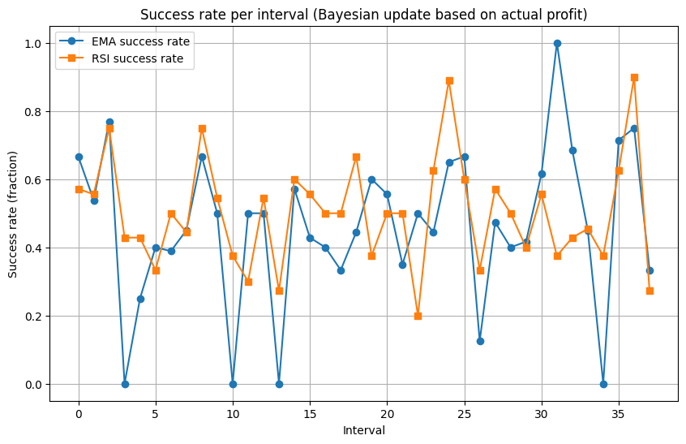
    


    
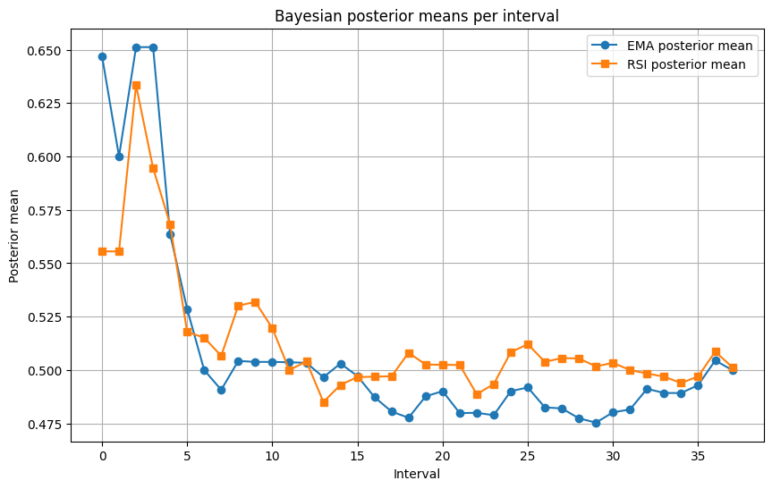
    


### Simple testing

From our previous analysis, we found that the RSI strategy generally outperforms the EMA strategy. To validate this observation, we test this theory on the last 500 days of stock prices. The testing code for this procedure is implemented in [`simple_testing.py`](Simplified%20Model/simple_testing.py), where trades are executed every 10 days.

The results from this testing show that the RSI strategy has a higher probability of success compared to the EMA strategy. The computed success rates for both strategies are summarized in [`summary.csv`](Simplified%20Model/summary.csv).

This approach allows us to verify that the trend observed in our earlier training (from 100th to 1999th day) also holds in a recent, unseen period, reinforcing the reliability of the RSI strategy for this dataset.


```python
# Simplified Model/simple_testing.py
import pandas as pd
import numpy as np
import yfinance as yf

# Load the recent 500 days price data
stock = "BHARTIARTL.NS"
data = yf.download(stock, period='500d', interval='1d')

# Flatten multi-index if present
if isinstance(data.columns, pd.MultiIndex):
    data.columns = data.columns.get_level_values(0)

# Data cleaning
data = data.reset_index()[['Date', 'Close']].copy()
data['Close'] = pd.to_numeric(data['Close'], errors='coerce')
data.dropna(subset=['Close'], inplace=True)

# Compute EMA(9) and EMA(21)
data['EMA9'] = data['Close'].ewm(span=9, adjust=False).mean()
data['EMA21'] = data['Close'].ewm(span=21, adjust=False).mean()

# Compute RSI(14)
delta = data['Close'].diff()
gain = np.where(delta > 0, delta, 0)
loss = np.where(delta < 0, -delta, 0)
avg_gain = pd.Series(gain).rolling(14, min_periods=14).mean()
avg_loss = pd.Series(loss).rolling(14, min_periods=14).mean()
rs = avg_gain / avg_loss
data['RSI'] = 100 - (100 / (1 + rs))

# RSI moving average (5-day)
data['RSI_MA'] = data['RSI'].rolling(5, min_periods=5).mean()

# Trading signals
data['EMA_signal'] = (data['EMA9'] > data['EMA21']).astype(int)
data['RSI_signal'] = (data['RSI'] < data['RSI_MA']).astype(int)

# Profit computation
data['Close_next'] = data['Close'].shift(-1)
data['Profit'] = (data['Close_next'] > data['Close']).astype(int)
data.dropna(inplace=True)

# Forward testing every 10 days
test_data = data.tail(500).copy()
trades = 10
indices = np.arange(0, len(test_data), trades)

ema_trades = test_data.iloc[indices][test_data.iloc[indices]['EMA_signal'] == 1]
rsi_trades = test_data.iloc[indices][test_data.iloc[indices]['RSI_signal'] == 1]
ema_win = ema_trades['Profit'].sum()
rsi_win = rsi_trades['Profit'].sum()

# Relative success rates
ema_success_rate = (ema_win / len(ema_trades)) if len(ema_trades) > 0 else 0
rsi_success_rate = (rsi_win / len(rsi_trades)) if len(rsi_trades) > 0 else 0

print("\nTesting every 10 days (success probabilities):")
print(f"EMA strategy: {ema_success_rate:.3f}")
print(f"RSI strategy: {rsi_success_rate:.3f}")

# Save summary with relative success rates
results = pd.DataFrame({
    'Strategy': ['EMA_Crossover', 'RSI_Strategy'],
    'Success_Probability': [ema_success_rate, rsi_success_rate]
})
results.to_csv('Simplified Model/summary.csv', index=False)

```

    [*********************100%***********************]  1 of 1 completed

    
    Testing every 10 days (success probabilities):
    EMA strategy: 0.514
    RSI strategy: 0.542
    

    
    

### Bayesian testing

In this other form of testing, we start with the prior as the posterior beta distribution from the training phase instead of taking $Beta(1, 1)$ for both strategies. Naturally, since we start from a knowledgeable prior, our success rates should be higher compared to the training phase.

We implement this in [`Bayesian_testing.py`](Simplified%20Model/Bayesian_testing.py). Clearly, the mean success rates for both the strategies have increased with a higher observed increase in the RSI strategy.


```python
# Simplified Model/Bayesian_testing.py
import pandas as pd
import numpy as np
import matplotlib.pyplot as plt

# Load indicator data
data = pd.read_csv('Stocks Data/Airtel_indicator_values.csv', index_col=0, parse_dates=True)

# Load training results to get final posterior alpha and beta and success rates
train_results = pd.read_csv('Simplified Model/results.csv')

# Initialize priors from training
prior = {
    'EMA_Crossover': {'alpha': train_results['EMA_alpha'].iloc[-1],
                      'beta': train_results['EMA_beta'].iloc[-1]},
    'RSI_Strategy': {'alpha': train_results['RSI_alpha'].iloc[-1],
                     'beta': train_results['RSI_beta'].iloc[-1]}
}

# Trading signals
data['EMA_signal'] = np.where(data['EMA9'] > data['EMA21'], 1, 0)
data['RSI_signal'] = np.where(data['RSI'] < data['RSI_MA'], 1, 0)
data['Close_next'] = data['Close'].shift(-1)
data['EMA_profit_actual'] = np.where((data['EMA_signal'] == 1) & (data['Close_next'] > data['Close']), 1, 0)
data['RSI_profit_actual'] = np.where((data['RSI_signal'] == 1) & (data['Close_next'] > data['Close']), 1, 0)
data = data[:-1]

test_data = data.iloc[2000:].copy()

# Hyperparameters
interval_size = 50
trades = 20
results = []
rsi_win = 0
ema_win = 0
tie = 0

num_intervals = len(test_data) // interval_size

for idx in range(num_intervals):
    start = idx * interval_size
    end = start + interval_size
    interval_data = test_data.iloc[start:end]

    step = len(interval_data) // trades
    trade_indices = np.arange(0, len(interval_data), step)[:trades]

    ema_signal_data = interval_data.iloc[trade_indices][interval_data.iloc[trade_indices]['EMA_signal'] == 1]
    rsi_signal_data = interval_data.iloc[trade_indices][interval_data.iloc[trade_indices]['RSI_signal'] == 1]

    ema_success = ema_signal_data['EMA_profit_actual'].sum()
    ema_total = len(ema_signal_data)
    rsi_success = rsi_signal_data['RSI_profit_actual'].sum()
    rsi_total = len(rsi_signal_data)

    if ema_total > 0:
        ema_rate = ema_success / ema_total
    else:
        ema_rate = np.mean([r['EMA_success_rate'] for r in results[-5:]]) if len(results) >= 5 else 0

    if rsi_total > 0:
        rsi_rate = rsi_success / rsi_total
    else:
        rsi_rate = np.mean([r['RSI_success_rate'] for r in results[-5:]]) if len(results) >= 5 else 0

    # Update priors
    prior['EMA_Crossover']['alpha'] += ema_success
    prior['EMA_Crossover']['beta'] += ema_total - ema_success
    prior['RSI_Strategy']['alpha'] += rsi_success
    prior['RSI_Strategy']['beta'] += rsi_total - rsi_success

    posterior_means = {
        'EMA_Crossover': prior['EMA_Crossover']['alpha'] / (prior['EMA_Crossover']['alpha'] + prior['EMA_Crossover']['beta']),
        'RSI_Strategy': prior['RSI_Strategy']['alpha'] / (prior['RSI_Strategy']['alpha'] + prior['RSI_Strategy']['beta'])
    }

    if rsi_rate > ema_rate:
        rsi_win += 1
    elif ema_rate > rsi_rate:
        ema_win += 1
    else:
        tie += 1

    results.append({
        'Interval': idx,
        'EMA_success_rate': ema_rate,
        'RSI_success_rate': rsi_rate,
        'EMA_posterior': posterior_means['EMA_Crossover'],
        'RSI_posterior': posterior_means['RSI_Strategy']
    })

# Save forward testing results
results_df = pd.DataFrame(results)
results_df.to_csv('Simplified Model/bayesian_testing_results.csv', index=False)

# Compute mean and variance for both training and testing
summary_stats = pd.DataFrame({
    'Strategy': ['EMA', 'RSI'],
    'Training_Mean': [train_results['EMA_posterior'].mean(), train_results['RSI_posterior'].mean()],
    'Training_Var': [train_results['EMA_posterior'].var(ddof=1), train_results['RSI_posterior'].var(ddof=1)],
    'Testing_Mean': [results_df['EMA_success_rate'].mean(), results_df['RSI_success_rate'].mean()],
    'Testing_Var': [results_df['EMA_success_rate'].var(ddof=1), results_df['RSI_success_rate'].var(ddof=1)]
})

print("\n--- Training vs Testing Success Rate Summary ---")
print(summary_stats.to_string(index=False))

# Plot relative success rates
train_plot_df = train_results.head(10)
test_plot_df = results_df.head(10)

plt.figure(figsize=(12,6))
plt.plot(train_plot_df['Interval'], train_plot_df['EMA_posterior'], marker='o', label='EMA training rate')
plt.plot(train_plot_df['Interval'], train_plot_df['RSI_posterior'], marker='s', label='RSI training rate')
plt.plot(test_plot_df['Interval'], test_plot_df['EMA_success_rate'], marker='^', linestyle='--', label='EMA testing rate')
plt.plot(test_plot_df['Interval'], test_plot_df['RSI_success_rate'], marker='v', linestyle='--', label='RSI testing rate')
plt.xlabel('Interval')
plt.ylabel('Success rate (fraction)')
plt.title('Training vs forward testing: relative success rates per interval')
plt.grid(True)
plt.legend()
plt.savefig("Simplified Model/Training_vs_testing_success_rates.png")
plt.show()

```

    
    --- Training vs Testing Success Rate Summary ---
    Strategy  Training_Mean  Training_Var  Testing_Mean  Testing_Var
         EMA       0.508912      0.002295      0.514882     0.042382
         RSI       0.514103      0.000916      0.579333     0.020971
    


    
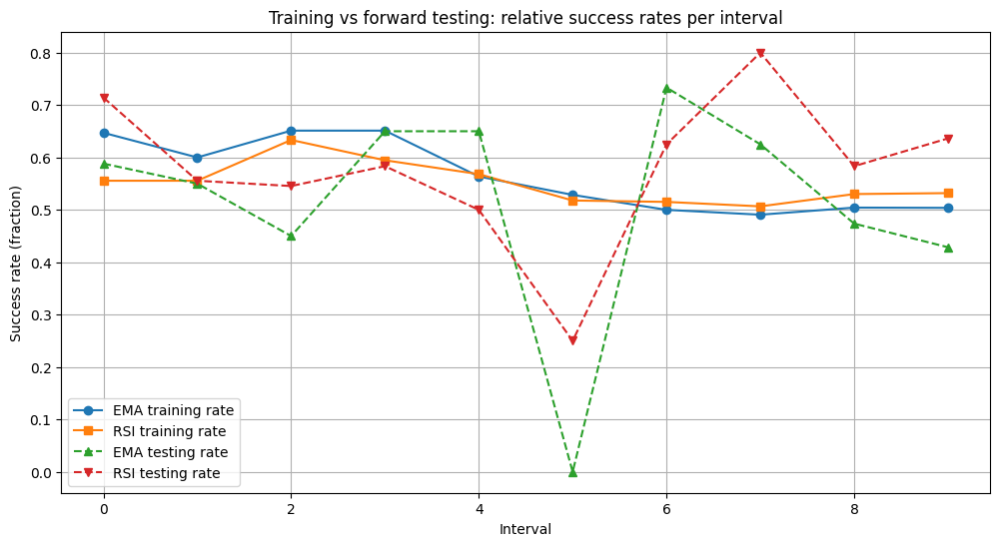
    


### Limitations of the simplified Bayesian model

The simplified Bayesian model has a few clear limitations:  

- We only consider whether a trade is profitable or not, ignoring the actual profit or loss for each trade. A single large loss could outweigh multiple profitable trades.  
- Some intervals may have no trading actions, which can act as outliers and distort success rate calculations and plots.  

To address these issues, we introduce an improvised version of the model that tracks not only the probability of success for each strategy but also the actual profits made, therefore yielding better results.


## Second section : Complex Bayesian Model

In this improvised version, along with using a Beta-Binomial model to estimate the probablity of success for each strategy, we also consider the Normal-Normal conjugate model with known variance to compute the returns from each strategy. Mathemetically, if $p_1$ and $p_2$ denote the probability of success for the EMA and RSI strategy, and $r_1$ and $r_2$ denote their corresponding returns, we have the following priors

- $p_1 \sim Beta(1, 1)$
- $p_2 \sim Beta(1, 1)$
- $r_1 \sim \mathcal{N}(\mu_1, \sigma_0^2)$
- $\mu_1 \sim \mathcal{N}(0, \tau_0^2)$
- $r_2 \sim \mathcal{N}(\mu_2, \sigma_0^2)$,
- $\mu_2 \sim \mathcal{N}(0, \tau_0^2)$

where $\tau_0^2 = 0.0004$ is the empirical prior variance, and $\sigma_0^2 = 0.0004$ is the chosen noise variance for returns. Additionally, we let the mean return to be zero for both the priors, which otherwise can be replaced by values obtained from historical data as well.

We implement this in the following code snippet from [`complex_traing_model.py`](Complex%20Model/complex_trading_model.py). The training dataset, number of batches, and the number of trades in each batch is exactly the same as in the first section.


```python
# Complex Model/complex_trading_model.py
import pandas as pd
import numpy as np
import matplotlib.pyplot as plt

# load indicator data
data = pd.read_csv('Stocks Data/Airtel_indicator_values.csv', index_col=0, parse_dates=True)

# initialize priors for each strategy
prior = {
    'EMA_crossover': {'alpha': 1.0, 'beta': 1.0, 'mu': 0.0, 'tau2': 0.0004},
    'RSI_strategy': {'alpha': 1.0, 'beta': 1.0, 'mu': 0.0, 'tau2': 0.0004}
}
sigma2 = 0.0004   # empirical noise variance
s = 100.0         # scaling factor for profit
M = 5.0           # clipping threshold

# trading rules
data['EMA_signal'] = (data['EMA9'] > data['EMA21']).astype(int)
data['RSI_signal'] = (data['RSI'] < data['RSI_MA']).astype(int)

# compute next-day return
data['close_next'] = data['Close'].shift(-1)
data['return'] = (data['close_next'] - data['Close']) / data['Close']
data = data.dropna().reset_index(drop=True)

# training data
train_data = data.iloc[100:2000].copy()

# hyperparameters
interval_size = 50
trades = 20
results = []
num_intervals = len(train_data) // interval_size
```

### Updating the Bayesian Parameters

We describe how this model updates the Bayesian parameters for both components as follows.

#### Updating the Beta-Binomial Model

Let $p_1 \sim \text{Beta}(\alpha_1, \beta_1)$ and $p_2 \sim \text{Beta}(\alpha_2, \beta_2)$ and let $r$ denote the return for the day. Let $s$ be a scaling factor to ensure the updates affect the priors significantly enough, and let $M$ be a bound to avoid outliers from huge returns in terms of magnitude.

Then, we define a new parameter $\delta = min(max(-M, s * r), M)$ which ensures that the scaled return $s * r$ stays between $-M$ and $M$.Subsequently, the Beta priors are updated as follows:

- If $r > 0$, i.e. the day yielded a profit,  we have $\alpha_1^{\prime} = \alpha_1 + 1 + \max(0, \delta)$ and $\beta_1^{\prime} = \beta_1$

- Otherwise if $r \le 0$, the day experiences a loss, we have $\alpha_1^{\prime} = \alpha_1$ and $\beta_1^{\prime} = \beta_1 + 1 + \max(0, -\delta)$.

Note that these updates are analogous to those in the first section, with the difference being the inclusion of the profit-adjusted term $\max(0, |\delta|)$

#### Updating the Normal-Normal Model

The Normal-Normal model update with known variance is the standard one, with sample size $n=1$ and return $r$, as implemented in [`complex_training_model.py`](Complex%20Model/complex_trading_model.py). Here, the posterior mean and variance are updated per trade based on the observed return.


The code also summarizes the results in a tablular format and saves them in [`results_with_weighted_beta.csv`](Complex%20Model/results_with_weighted_beta.csv), which includes interval-level and cumulative profits, as well as posterior parameters for both strategies.


```python

# Complex Model/complex_trading_model.py
# for plotting
profit_history = {s: [] for s in prior}
posterior_return_history = {s: [] for s in prior}
posterior_prob_history = {s: [] for s in prior}

# track running cumulative profit across intervals
cum_profits = {s: 0.0 for s in prior}

# store PPD variance
ppd_variance_history = {s: [] for s in prior}

# Updating the bayesian paramaters
for idx in range(num_intervals):
    start = idx * interval_size
    end = start + interval_size
    interval_data = train_data.iloc[start:end]

    # equally spaced trades
    step = len(interval_data) // trades
    trade_indices = np.arange(0, len(interval_data), step)[:trades]

    total_profits = {s: 0.0 for s in prior}

    for t_idx in trade_indices:
        row = interval_data.iloc[t_idx]

        for strat in prior:
            signal_col = 'EMA_signal' if strat == 'EMA_crossover' else 'RSI_signal'
            r_t = row['return']

            if row[signal_col] == 1:
                # weighted beta update based on profit
                c = np.clip(s * r_t, -M, M)
                prior[strat]['alpha'] += 1.0 + max(0.0, c)
                prior[strat]['beta']  += 1.0 + max(0.0, -c)

                # normal-normal update for return magnitude
                mu, tau2 = prior[strat]['mu'], prior[strat]['tau2']
                q_old = 1.0 / tau2
                q_new = q_old + 1.0 / sigma2
                mu_new = (q_old * mu + r_t / sigma2) / q_new
                tau2_new = 1.0 / q_new
                prior[strat]['mu'], prior[strat]['tau2'] = mu_new, tau2_new

                total_profits[strat] += r_t

    # update running cumulative profits
    for strat in cum_profits:
        cum_profits[strat] += total_profits[strat]

    # posterior mean (probability)
    posterior_means = {s: prior[s]['alpha'] / (prior[s]['alpha'] + prior[s]['beta']) for s in prior}

    # compute PPD variance
    for strat in prior:
        ppd_var = sigma2 + prior[strat]['tau2']
        ppd_variance_history[strat].append(ppd_var)

    results.append({
        'Interval': idx,
        'EMA_alpha': prior['EMA_crossover']['alpha'],
        'EMA_beta': prior['EMA_crossover']['beta'],
        'RSI_alpha': prior['RSI_strategy']['alpha'],
        'RSI_beta': prior['RSI_strategy']['beta'],
        'EMA_posterior': posterior_means['EMA_crossover'],
        'RSI_posterior': posterior_means['RSI_strategy'],
        'EMA_interval_profit': total_profits['EMA_crossover'],
        'RSI_interval_profit': total_profits['RSI_strategy'],
        'EMA_cum_profit': cum_profits['EMA_crossover'],
        'RSI_cum_profit': cum_profits['RSI_strategy'],
        'EMA_posterior_return': prior['EMA_crossover']['mu'],
        'RSI_posterior_return': prior['RSI_strategy']['mu'],
        'EMA_ppd_var': ppd_variance_history['EMA_crossover'][-1],
        'RSI_ppd_var': ppd_variance_history['RSI_strategy'][-1]
    })

    for strat in prior:
        profit_history[strat].append(total_profits[strat])
        posterior_return_history[strat].append(prior[strat]['mu'])
        posterior_prob_history[strat].append(posterior_means[strat])

# save results 
results_df = pd.DataFrame(results)
results_df.to_csv('Complex Model/results_with_weighted_beta.csv', index=False)
```

### Summary

Similar to the first section, the results show consistent numerical trends favoring the RSI strategy over the EMA strategy. Specifically:

- The RSI strategy exhibits higher posterior means for both returns and the fraction of successful trades, accompanied by lower variance compared to the EMA strategy.
- The mean profit achieved from the RSI strategy is higher than that of the EMA strategy.

These trends are also reflected in the plots:

- The first plot shows the profit per interval for both strategies. While the values fluctuate across intervals, the RSI strategy appears to have marginally better profits in a few intervals.
- The second plot shows cumulative profits across the intervals. Here, the RSI strategy clearly outperforms EMA, with a final cumulative return of approximately 0.78 for RSI versus 0.24 for EMA.
- The final two plots depict the posterior mean returns and the posterior success probabilities for each strategy. The plots appear similar, suggesting a direct relationship between mean success probability and mean return for this dataset. However, this relationship may not always hold for other datasets.


```python

# Complex Model/complex_trading_model.py
# create dataframes for plotting
profits_df = pd.DataFrame(profit_history)
posterior_return_df = pd.DataFrame(posterior_return_history)
posterior_prob_df = pd.DataFrame(posterior_prob_history)

# Summary statistics
summary_stats = pd.DataFrame({
    'strategy': [s for s in prior],
    'profit_mean': [profits_df[s].mean() for s in prior],
    'profit_var': [profits_df[s].var(ddof=1) for s in prior],
    'posterior_return_mean': [posterior_return_df[s].mean() for s in prior],
    'posterior_return_var': [posterior_return_df[s].var(ddof=1) for s in prior],
    'posterior_prob_mean': [posterior_prob_df[s].mean() for s in prior],
    'posterior_prob_var': [posterior_prob_df[s].var(ddof=1) for s in prior],
})
print("\nComplex model summary statistics")
print(summary_stats.to_string(index=False))

# Profit per interval plot
plt.figure(figsize=(10,6))
for strat in prior:
    plt.plot(profits_df.index+1, profits_df[strat], marker='o', label=f'{strat} profit per interval')
plt.xlabel('interval')
plt.ylabel('profit per interval')
plt.title('profit per interval (complex model)')
plt.grid(True)
plt.legend()
plt.savefig('Complex Model/profit_per_interval.png')
plt.show()

# Cumulative profit plot 
plt.figure(figsize=(10,6))
for strat in prior:
    plt.plot(profits_df.index+1, profits_df[strat].cumsum(), marker='o', label=f'{strat} cum profit')
plt.xlabel('interval')
plt.ylabel('cum profit')
plt.title('cum profit across intervals (complex model)')
plt.grid(True)
plt.legend()
plt.savefig('Complex Model/cum_profit.png')
plt.show()

# Posterior mean return plot
plt.figure(figsize=(10,6))
for strat in prior:
    plt.plot(posterior_return_df.index+1, posterior_return_df[strat], marker='o', label=f'{strat} posterior mean return')
plt.xlabel('interval')
plt.ylabel('posterior mean return')
plt.title('posterior mean return progression (complex model)')
plt.grid(True)
plt.legend()
plt.savefig('Complex Model/posterior_mean_return_progression.png')
plt.show()

# Posterior mean probability plot
plt.figure(figsize=(10,6))
for strat in prior:
    plt.plot(posterior_prob_df.index+1, posterior_prob_df[strat], marker='o', label=f'{strat} posterior mean probability')
plt.xlabel('interval')
plt.ylabel('posterior mean probability')
plt.title('posterior mean probability progression (complex model)')
plt.grid(True)
plt.legend()
plt.savefig('Complex Model/posterior_mean_probability_progression.png')
plt.show()


```

    
    Complex model summary statistics
         strategy  profit_mean  profit_var  posterior_return_mean  posterior_return_var  posterior_prob_mean  posterior_prob_var
    EMA_crossover     0.006528    0.004474              -0.000955              0.000002             0.480280            0.000478
     RSI_strategy     0.020652    0.005474               0.000914              0.000002             0.511645            0.000402
    


    
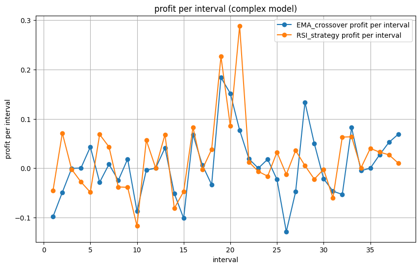
    


    
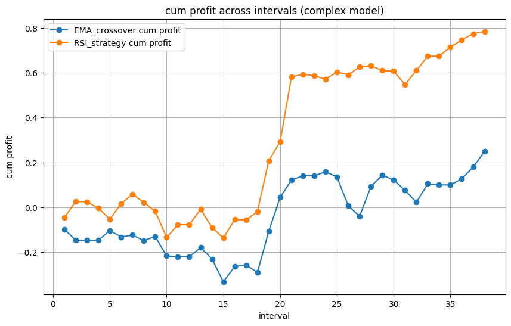
    


    
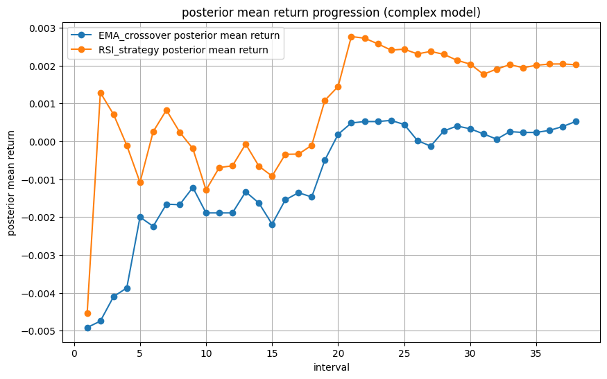
    


    
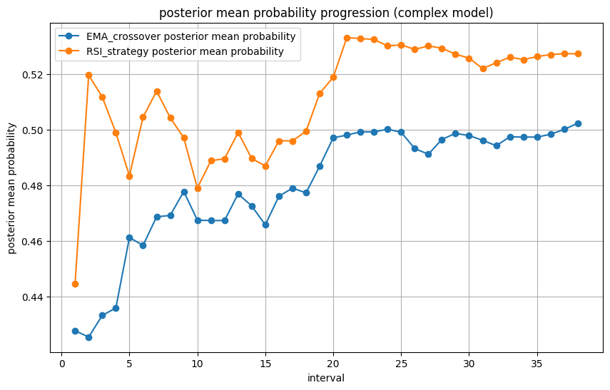
    


### Posterior Predictive Distribution Analysis

The Posterior Predictive Distribution $P(r_{\text{new}} \mid r)$ for the Normal–Normal model with known variance is computed in the following fashion. If the posterior for the mean return is $\mathcal{N}(\mu_{\text{post}}, \tau^2)$ and the data variance is $\sigma^2$, then $P(r_{\text{new}} \mid r) \sim \mathcal{N}(\mu_{\text{post}}, \tau^2 + \sigma^2)$.  

#### 1. Posterior Predictive Probability
For each interval, we compute the probability that the next trade’s return exceeds a target value $r^*$, i.e. $P(r > r^*)$. Two targets are considered: $r^* = 0$ (non-negative return) and $r^* = 0.001$ (0.1% positive return).  

The **RSI strategy** consistently shows higher predictive probabilities in both targets, which can be seen from the first two plots and the higher mean returns in the summary table.

#### 2. Posterior Predictive Intervals
The $95$% predictive intervals for each strategy are computed as $\mu_{\text{post}} \pm 1.96 \sqrt{\tau^2 + \sigma^2}$ for each interval.
These intervals represent the range in which we expect the next-trade return to lie with a certain probability. 

Both the mean upper and lower limits of these intervals are higher for the RSI strategy, further supporting its stronger posterior performance relative to EMA. This is also reflected in the third plot.

#### 3. Comparison Between Strategies
The probability that the EMA strategy outperforms the RSI strategy is given by $P(\text{EMA} > \text{RSI}) = 1 - \Phi\Big((\mu_{\text{RSI}} - \mu_{\text{EMA}}) / \sqrt{\tau_{\text{EMA}}^2 + \tau_{\text{RSI}}^2 + 2\sigma^2}\Big)$, where $\Phi$ denotes the CDF of the standard normal distribution.  

The resulting probability remains around **0.47** with very low variance, suggesting that RSI outperforms EMA by roughly **3%** on average. The final plot further bolsters these numbers.

The full implementation can be found in [`PPD.py`](Complex%20Model/PPD.py).


```python
# Complex Model/PPD.py
import pandas as pd
import numpy as np
import matplotlib.pyplot as plt
from scipy.stats import norm

# Load results from training
results_df = pd.read_csv('Complex Model/results_with_weighted_beta.csv')

strategies = ['EMA_crossover', 'RSI_strategy']
r_targets = [0.0, 0.001]  # 0% and 0.1%

ppd_prob_dfs = {}
ppd_lower_ci = {}
ppd_upper_ci = {}

# Compute posterior predictive probabilities and CI
for strat in strategies:
    mu = results_df[f'{strat[:3]}_posterior_return'].values
    var = results_df[f'{strat[:3]}_ppd_var'].values
    std = np.sqrt(np.maximum(var, 1e-12))

    for r_target in r_targets:
        probs = 1 - norm.cdf(r_target, loc=mu, scale=std)
        if r_target not in ppd_prob_dfs:  # Avoid duplication
            ppd_prob_dfs[r_target] = pd.DataFrame()
        ppd_prob_dfs[r_target][strat] = probs

    # Store PPD 95% CI bounds
    ppd_lower_ci[strat] = mu - 1.96 * std
    ppd_upper_ci[strat] = mu + 1.96 * std

# Compute EMA > RSI probability analytically
mu_EMA = results_df['EMA_posterior_return'].values
mu_RSI = results_df['RSI_posterior_return'].values
tau2_EMA = results_df['EMA_ppd_var'].values
tau2_RSI = results_df['RSI_ppd_var'].values

diff_mean = mu_EMA - mu_RSI
diff_std = np.sqrt(np.maximum(tau2_EMA + tau2_RSI, 1e-12))
p_EMA_beats_RSI = 1 - norm.cdf(0, loc=diff_mean, scale=diff_std)

intervals = results_df['Interval'].values + 1

# Summary statistics 
summary_ppd = pd.DataFrame({
    'strategy': strategies,
    'ppd_prob_mean_r0': [ppd_prob_dfs[0.0][s].mean() for s in strategies],
    'ppd_prob_var_r0': [ppd_prob_dfs[0.0][s].var(ddof=1) for s in strategies],
    'ppd_prob_mean_r001': [ppd_prob_dfs[0.001][s].mean() for s in strategies],
    'ppd_prob_var_r001': [ppd_prob_dfs[0.001][s].var(ddof=1) for s in strategies],
    'ppd_ci_lower_mean': [ppd_lower_ci[s].mean() for s in strategies],
    'ppd_ci_upper_mean': [ppd_upper_ci[s].mean() for s in strategies],
})

comparison_summary = pd.DataFrame({
    'comparison': ['EMA > RSI'],
    'mean_prob': [p_EMA_beats_RSI.mean()],
    'var_prob': [p_EMA_beats_RSI.var(ddof=1)]
})

print("\nPosterior Predictive Summary Statistics")
print(summary_ppd.to_string(index=False, float_format="{:.6f}".format))

print("\nComparison Summary (Probability that EMA beats RSI)")
print(comparison_summary.to_string(index=False, float_format="{:.6f}".format))

# Plot Section

# PPD Probability Plots 
for r_target in r_targets:
    plt.figure(figsize=(10,6))
    for strat in strategies:
        plt.plot(intervals, ppd_prob_dfs[r_target][strat].values, marker='o',
                 label=f'{strat} P(r>{r_target*100:.1f}%)')
    plt.xlabel('Interval')
    plt.ylabel('Probability')
    plt.title(f'Posterior Predictive probability per interval (r* = {r_target*100:.1f}%)')
    plt.ylim(0,1)
    plt.grid(True)
    plt.legend()
    plt.show()

# Posterior Predictive 95% CI Plot 
plt.figure(figsize=(10,6))
for strat in strategies:
    plt.plot(intervals, results_df[f'{strat[:3]}_posterior_return'].values, marker='o',
             label=f'{strat} Posterior mean')
    plt.fill_between(intervals,
                     ppd_lower_ci[strat],
                     ppd_upper_ci[strat],
                     alpha=0.2, label=f'{strat} 95% PPD CI')
plt.xlabel('Interval')
plt.ylabel('Next-trade return')
plt.title('Posterior Predictive 95% CI for next-trade return')
plt.grid(True)
plt.legend()
plt.show()

# EMA vs RSI Comparison 
plt.figure(figsize=(10,6))
plt.plot(intervals, p_EMA_beats_RSI, marker='o', color='purple', label='P_EMA > P_RSI')
plt.ylim(0,1)
plt.xlabel('Interval')
plt.ylabel('Probability')
plt.title('Probability that EMA strategy outperforms RSI strategy')
plt.grid(True)
plt.legend()
plt.show()

```

    
    Posterior Predictive Summary Statistics
         strategy  ppd_prob_mean_r0  ppd_prob_var_r0  ppd_prob_mean_r001  ppd_prob_var_r001  ppd_ci_lower_mean  ppd_ci_upper_mean
    EMA_crossover          0.481254         0.000919            0.461500           0.000904          -0.040324           0.038414
     RSI_strategy          0.518260         0.000934            0.498482           0.000926          -0.038500           0.040327
    
    Comparison Summary (Probability that EMA beats RSI)
    comparison  mean_prob  var_prob
     EMA > RSI   0.473836  0.000212
    


    
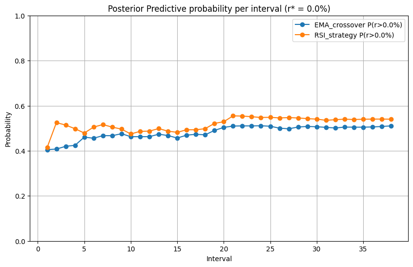
    


    
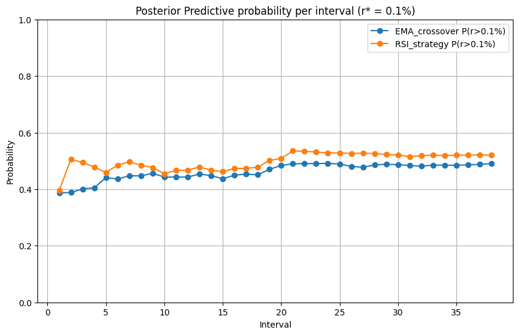
    


    
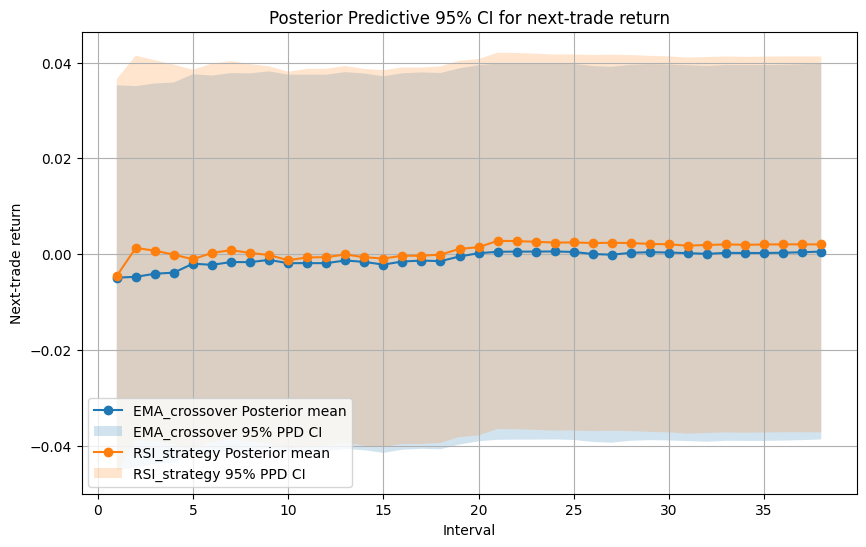
    


    
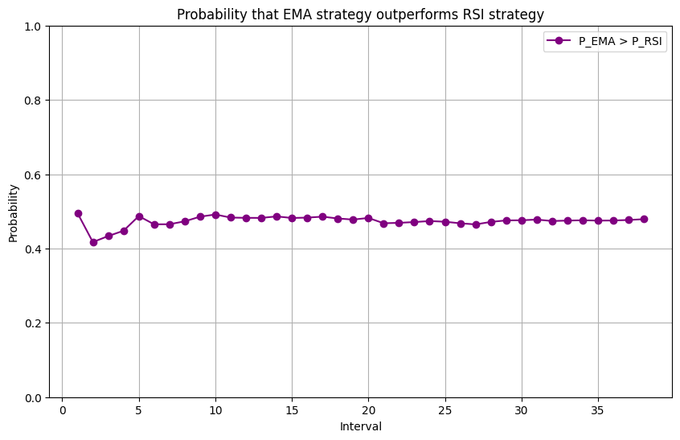
    


### Simple Testing

Based on our earlier analysis, the RSI strategy tends to outperform the EMA strategy. To validate this observation, we perform a forward test using the last 500 closing prices of the Airtel stock. Trades are executed every 10 days to simulate periodic decision-making similar to the first section.

The implementation of this procedure is provided in [`Simple_testing.py`](Complex%20Model/Simple_testing.py). The testing results confirm that the RSI strategy achieves a higher cumulative return compared to the EMA strategy, consistent with the trends observed during training.  


```python
# Complex Model/Simple_testing.py
import pandas as pd
import numpy as np
import matplotlib.pyplot as plt
import yfinance as yf

# Load recent 500 days price data
stock = "BHARTIARTL.NS"
data = yf.download(stock, period='500d', interval='1d')

# Flatten MultiIndex columns if exists
if isinstance(data.columns, pd.MultiIndex):
    data.columns = data.columns.get_level_values(0)

# Data cleaning
data = data.reset_index()
data = data[['Date', 'Close']].copy()
data['Close'] = pd.to_numeric(data['Close'], errors='coerce')
data.dropna(subset=['Close'], inplace=True)

# Compute indicators
data['EMA9'] = data['Close'].ewm(span=9, adjust=False).mean()
data['EMA21'] = data['Close'].ewm(span=21, adjust=False).mean()

# RSI computation
delta = data['Close'].diff()
gain = np.where(delta > 0, delta, 0)
loss = np.where(delta < 0, -delta, 0)
avg_gain = pd.Series(gain).rolling(14, min_periods=14).mean()
avg_loss = pd.Series(loss).rolling(14, min_periods=14).mean()
rs = avg_gain / avg_loss
data['RSI'] = 100 - (100 / (1 + rs))
data['RSI_MA'] = data['RSI'].rolling(5, min_periods=5).mean()

# Signals
data['EMA_signal'] = np.where(data['EMA9'] > data['EMA21'], 1, 0)
data['RSI_signal'] = np.where(data['RSI'] < data['RSI_MA'], 1, 0)

# Next-day returns
data['Close_next'] = data['Close'].shift(-1)
data['Return'] = (data['Close_next'] - data['Close']) / data['Close']
data.dropna(inplace=True)

# Forward test: last 500 days
test_data = data.tail(500).copy()

# Settings
interval_size = 10  # every 10 days
indices = np.arange(0, len(test_data), interval_size)

# Initialize history
strategy_results = {
    'EMA_Crossover': {'Profit_Count': 0, 'Total_Return': 0.0, 'Trades': 0},
    'RSI_Strategy': {'Profit_Count': 0, 'Total_Return': 0.0, 'Trades': 0}
}

# Evaluate each strategy separately
for strat in strategy_results:
    signal_col = 'EMA_signal' if strat == 'EMA_Crossover' else 'RSI_signal'
    trades_subset = test_data.iloc[indices][test_data.iloc[indices][signal_col] == 1]
    
    strategy_results[strat]['Trades'] = len(trades_subset)
    strategy_results[strat]['Profit_Count'] = (trades_subset['Return'] > 0).sum()
    strategy_results[strat]['Total_Return'] = trades_subset['Return'].sum()

# Create summary DataFrame
summary = pd.DataFrame({
    'Strategy': list(strategy_results.keys()),
    'Cumulative_Return': [strategy_results[s]['Total_Return'] for s in strategy_results],
})

print(summary.to_string(index=False))

```

    [*********************100%***********************]  1 of 1 completed

         Strategy  Cumulative_Return
    EMA_Crossover          -0.034036
     RSI_Strategy          -0.007031
    

    
    

### Bayesian Testing

While the mean returns during the testing phase show only a slight improvement compared to the training phase, the variance has decreased significantly.This reduction in variance indicates that the model’s predictions have become more stable and reliable, giving us greater confidence in the consistency of returns.

The implementation can be found in [`Bayesian_testing.py`](Complex%20Model/Bayesian_testing.py). The code also visualizes the **profit per interval** for both strategies across the training and testing phases.


```python
# Complex Model/Bayesian_testing.py
import pandas as pd
import numpy as np
import matplotlib.pyplot as plt

# Load indicator data
data = pd.read_csv('Stocks Data/Airtel_indicator_values.csv', index_col=0, parse_dates=True)

# Load training results to get final posterior alpha/beta and returns
train_results = pd.read_csv('Complex Model/results_with_weighted_beta.csv')

# Initialize priors from final training results
prior = {
    'EMA_Crossover': {
        'alpha': train_results['EMA_alpha'].iloc[-1],
        'beta': train_results['EMA_beta'].iloc[-1],
        'mu': train_results['EMA_posterior_return'].iloc[-1],
        'tau2': 0.0004
    },
    'RSI_Strategy': {
        'alpha': train_results['RSI_alpha'].iloc[-1],
        'beta': train_results['RSI_beta'].iloc[-1],
        'mu': train_results['RSI_posterior_return'].iloc[-1],
        'tau2': 0.0004
    }
}

sigma2 = 0.0004
s = 100.0
M = 5.0

# Trading signals
data['EMA_signal'] = (data['EMA9'] > data['EMA21']).astype(int)
data['RSI_signal'] = (data['RSI'] < data['RSI_MA']).astype(int)
data['Return'] = (data['Close'].shift(-1) - data['Close']) / data['Close']
data = data.dropna().reset_index(drop=True)

# Forward testing data
test_data = data.iloc[2000:].copy()
interval_size = 20
trades_per_interval = 5
results = []

num_intervals = len(test_data) // interval_size

for idx in range(num_intervals):
    start = idx * interval_size
    end = start + interval_size
    interval_data = test_data.iloc[start:end]

    step = len(interval_data) // trades_per_interval
    trade_indices = np.arange(0, len(interval_data), step)[:trades_per_interval]

    profits = {s: [] for s in prior}

    for t_idx in trade_indices:
        row = interval_data.iloc[t_idx]
        r_t = row['Return']
        for strat in prior:
            signal_col = 'EMA_signal' if strat == 'EMA_Crossover' else 'RSI_signal'
            if row[signal_col] == 1:
                # Weighted Beta update
                c = np.clip(s * r_t, -M, M)
                prior[strat]['alpha'] += 1.0 + max(0.0, c)
                prior[strat]['beta']  += 1.0 + max(0.0, -c)

                # Normal-Normal update
                mu, tau2 = prior[strat]['mu'], prior[strat]['tau2']
                q_old = 1.0 / tau2
                q_new = q_old + 1.0 / sigma2
                mu_new = (q_old * mu + r_t / sigma2) / q_new
                tau2_new = 1.0 / q_new
                prior[strat]['mu'], prior[strat]['tau2'] = mu_new, tau2_new

                profits[strat].append(r_t)

    avg_profits = {s: np.mean(profits[s]) if profits[s] else 0.0 for s in prior}
    posterior_means = {s: prior[s]['alpha'] / (prior[s]['alpha'] + prior[s]['beta']) for s in prior}

    results.append({
        'Interval': idx,
        'EMA_interval_profit': avg_profits['EMA_Crossover'],
        'RSI_interval_profit': avg_profits['RSI_Strategy'],
        'EMA_posterior': posterior_means['EMA_Crossover'],
        'RSI_posterior': posterior_means['RSI_Strategy'],
        'EMA_posterior_return': prior['EMA_Crossover']['mu'],
        'RSI_posterior_return': prior['RSI_Strategy']['mu']
    })

# Save forward testing results
results_df = pd.DataFrame(results)
results_df.to_csv('Complex Model/forward_testing_profit.csv', index=False)
print("Forward-testing results (profit per interval) saved!")

# Compute summary statistics
summary_stats = pd.DataFrame({
    'Strategy': ['EMA', 'RSI'],
    'Training_Mean': [
        train_results['EMA_interval_profit'].mean(),
        train_results['RSI_interval_profit'].mean()
    ],
    'Training_Var': [
        train_results['EMA_interval_profit'].var(ddof=1),
        train_results['RSI_interval_profit'].var(ddof=1)
    ],
    'Testing_Mean': [
        results_df['EMA_interval_profit'].mean(),
        results_df['RSI_interval_profit'].mean()
    ],
    'Testing_Var': [
        results_df['EMA_interval_profit'].var(ddof=1),
        results_df['RSI_interval_profit'].var(ddof=1)
    ]
})

print("\n--- Training vs Testing Profit per Interval Summary ---")
print(summary_stats.to_string(index=False))

# Plot: Training vs Testing Profit per Interval
plt.figure(figsize=(12,6))

# Align intervals visually
train_x = np.arange(len(train_results.tail(10)))
test_x = np.arange(len(results_df.head(10)))

plt.plot(train_x, train_results.tail(10)['EMA_interval_profit'], marker='o', label='EMA training')
plt.plot(train_x, train_results.tail(10)['RSI_interval_profit'], marker='s', label='RSI training')
plt.plot(test_x, results_df.head(10)['EMA_interval_profit'], marker='^', linestyle='--', label='EMA testing')
plt.plot(test_x, results_df.head(10)['RSI_interval_profit'], marker='v', linestyle='--', label='RSI testing')

plt.xlabel('Interval Index')
plt.ylabel('Average Profit per Interval')
plt.title('Complex Model: Training vs Forward Testing (Profit per Interval)')
plt.grid(True)
plt.legend()
plt.tight_layout()
plt.savefig("Complex Model/training_vs_testing_profit_per_interval.png")
plt.show()
```

    Forward-testing results (profit per interval) saved!
    
    --- Training vs Testing Profit per Interval Summary ---
    Strategy  Training_Mean  Training_Var  Testing_Mean  Testing_Var
         EMA       0.006528      0.004474      0.003268     0.000067
         RSI       0.020652      0.005474      0.004587     0.000063
    


    
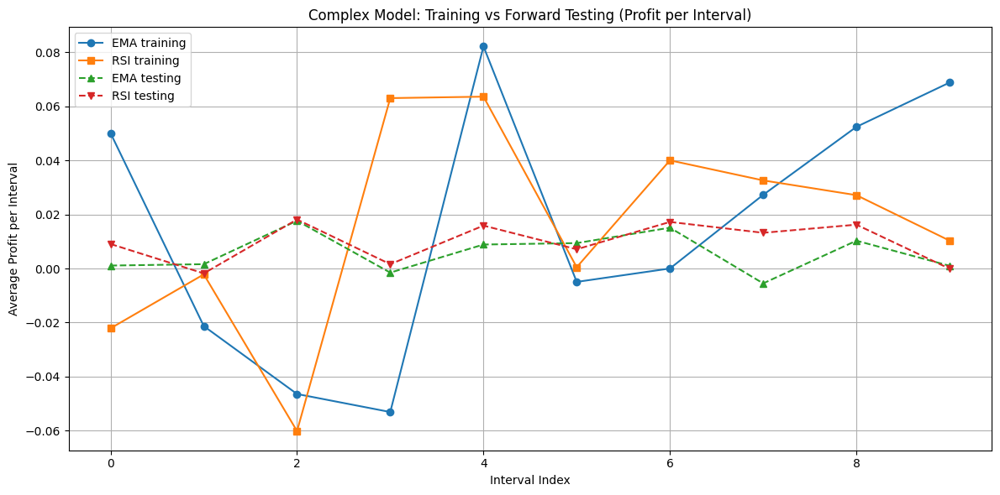
    

# Section 3: Multiple Strategy Modelling

Now we will compare the number of profitable trades using multiple strategies. To accomplish this, we use a generalized Beta-Binomial model called Dirichlet-Multinomial model when there are multiple parameters involved.
## Dirichlet-Multinomial Model

The **Dirichlet–Multinomial distribution** is a _compound probability distribution_ that arises when the parameters of a **Multinomial distribution** are themselves random variables drawn from a **Dirichlet distribution**. It is commonly used to model **categorical count data with overdispersion**, where the observed variance exceeds that predicted by a standard multinomial model.
### Definition

Consider a multinomial distribution with parameters $n$ (number of trials) and $\mathbf{p} = (p_1, p_2, \ldots, p_K)$, where $\sum_{i=1}^K p_i = 1$ and $p_i \ge 0$.  
If the vector of probabilities $\mathbf{p}$ is itself drawn from a Dirichlet distribution with concentration parameters $\boldsymbol{\alpha} = (\alpha_1, \alpha_2, \ldots, \alpha_K)$, i.e.
$$p \sim \text{Dirichlet}(\boldsymbol{\alpha})$$
then the resulting marginal distribution over counts $\mathbf{x} = (x_1, x_2, \ldots, x_K)$, where $\sum_{i=1}^K x_i = n$, follows a **Dirichlet–Multinomial distribution**:
$$\mathbf{x} \sim \text{Dirichlet–Multinomial}(n, \boldsymbol{\alpha})$$
### Prior

Assume the category probabilities $\mathbf{p} = (p_1, p_2, \ldots, p_K)$
follow a Dirichlet prior: $$\mathbf{p} \sim \text{Dirichlet}(\boldsymbol{\alpha})$$with parameters $\boldsymbol{\alpha} = (\alpha_1, \ldots, \alpha_K)$.
### Likelihood

Given $\mathbf{p}$, the observed counts $$\mathbf{x} = (x_1, x_2, \ldots, x_K), \quad \sum_{i=1}^K x_i = n$$are drawn from a Multinomial distribution: $$\mathbf{x} \mid \mathbf{p} \sim \text{Multinomial}(n, \mathbf{p})$$The likelihood is: $$P(\mathbf{x} \mid \mathbf{p}) = \frac{n!}{\prod_{i=1}^K x_i!} \prod_{i=1}^K p_i^{x_i}$$
### Posterior

Using Bayes’ rule, the posterior over $\mathbf{p}$ is also Dirichlet: $$\mathbf{p} \mid \mathbf{x} \sim \text{Dirichlet}(\boldsymbol{\alpha} + \mathbf{x}),$$i.e., $$p_i \mid \mathbf{x} \sim \text{Dirichlet}(\alpha_i + x_i) \quad \text{for each } i.$$

## Computing Indicator values

We will compare the following strategies 
- SMA_Crossover
- Momentum_Positive
- RSI_Oversold_Rebound
- RSI_Overbought_Reversal
- Price_Above_EMA9
by modelling them as Dirichlet-Multinomial. But before applying these strategies, they require some indicator values in order to apply them. 

```Python
# ============================================================
# Airtel Stock Data - Indicator Computation Script
# ============================================================

import pandas as pd
import numpy as np
import yfinance as yf
import os

# ------------------------------------------------------------
# Download Airtel stock data
# ------------------------------------------------------------
print("Downloading Airtel stock data...")
data = yf.download('BHARTIARTL.NS', period='2500d', interval='1d')

# --- Flatten MultiIndex if present ---
if isinstance(data.columns, pd.MultiIndex):
    data.columns = ['_'.join(col).strip() for col in data.columns.values]

# --- Handle possible column naming differences ---
close_col = [c for c in data.columns if 'Close' in c][0]

data = data.reset_index()[['Date', close_col]].rename(columns={close_col: 'Close'})
data['Close'] = pd.to_numeric(data['Close'], errors='coerce')
data.dropna(inplace=True)

# ------------------------------------------------------------
# Compute Required Indicators
# ------------------------------------------------------------

## --- EMA (for Price above EMA9 strategy) ---
data['EMA9'] = data['Close'].ewm(span=9, adjust=False).mean()

## --- SMA crossover indicators ---
data['SMA20'] = data['Close'].rolling(20).mean()
data['SMA50'] = data['Close'].rolling(50).mean()

## --- RSI (for Oversold Rebound & Overbought Reversal) ---
delta = data['Close'].diff()
gain = np.where(delta > 0, delta, 0)
loss = np.where(delta < 0, -delta, 0)
avg_gain = pd.Series(gain).rolling(14, min_periods=14).mean()
avg_loss = pd.Series(loss).rolling(14, min_periods=14).mean()
rs = avg_gain / np.where(avg_loss == 0, np.nan, avg_loss)
data['RSI'] = 100 - (100 / (1 + rs))
data['RSI_MA'] = data['RSI'].rolling(5, min_periods=5).mean()

## --- Momentum (for Momentum Positive strategy) ---
data['Momentum'] = data['Close'] - data['Close'].shift(3)

## --- Next-day Close (for future trade labeling if needed) ---
data['Close_next'] = data['Close'].shift(-1)

# ------------------------------------------------------------
# Keep Only Required Columns
# ------------------------------------------------------------
cols_to_keep = [
    'Date',
    'Close',
    'EMA9',
    'SMA20',
    'SMA50',
    'RSI',
    'RSI_MA',
    'Momentum',
    'Close_next'
]

data = data[cols_to_keep].dropna().reset_index(drop=True)

# ------------------------------------------------------------
# Save the final filtered indicator file
# ------------------------------------------------------------
output_file = 'Airtel_selected_strategies.csv'
data.to_csv(output_file, index=False)

print(f"Saved {output_file} with only the selected strategy indicators.")
```
### Data Acquisition and Preparation

The code begins by downloading **daily historical stock data** for _Bharti Airtel_ using the `yfinance` library:
```Python
data = yf.download('BHARTIARTL.NS', period='2500d', interval='1d')
```
- The data covers the past **~2500 trading days** (roughly 10 years).
- Only the **Date** and **Close price** columns are retained for analysis.
- Any missing or non-numeric data is removed to ensure accuracy.
### Computation of Technical Indicators

Several important **technical indicators** are computed to capture different aspects of stock price behavior:
#### (a) Exponential Moving Average (EMA9)

The **9-day Exponential Moving Average** smoothens out short-term price fluctuations and highlights the underlying trend. It is calculated using: $$\text{EMA}_t = \alpha \cdot \text{Close}_t + (1 - \alpha) \cdot \text{EMA}_{t-1}, \quad \text{where } \alpha = \frac{2}{9 + 1}$$
- Used in **“Price above EMA9”** strategy to detect short-term bullish or bearish trends.
- A price above EMA9 often signals upward momentum.
#### (b) Simple Moving Averages (SMA20 and SMA50)

Two **Simple Moving Averages** are computed:
- **SMA20:** 20-day average — short-term trend
- **SMA50:** 50-day average — medium-term trend
They are defined as:
$$\text{SMA}_t(k) = \frac{1}{k} \sum_{i=0}^{k-1} \text{Close}_{t-i}$$
- The **SMA crossover** (e.g., SMA20 > SMA50) is often used to detect **trend reversals** or **trend confirmations**.
#### (c) Relative Strength Index (RSI)

The **Relative Strength Index (RSI)** is a momentum oscillator that measures the magnitude of recent price changes to evaluate **overbought** or **oversold** conditions.  
It is computed over a 14-day window as: $$\text{RSI} = 100 - \frac{100}{1 + \frac{\text{Average Gain}}{\text{Average Loss}}}$$
- **High RSI (>70):** indicates overbought conditions (possible price reversal downwards).
- **Low RSI (<30):** indicates oversold conditions (possible price rebound).
- A **5-day moving average of RSI (RSI_MA)** is also calculated to smooth RSI values.
#### (d) Momentum

Momentum measures the rate of price change over a short period (3 days here): $$\text{Momentum}_t = \text{Close}_t - \text{Close}_{t-3}$$
- A **positive momentum** implies upward movement and buying pressure.
- A **negative momentum** indicates downward movement or selling pressure.
- Useful in **momentum trading strategies**.
#### (e) Next-Day Close

A shifted column is created: $$\text{Close}_{t+1} = \text{Close shifted by one day}.$$This allows for **future return labeling**, useful in supervised learning or strategy back-testing.
## Multiple Strategy Evaluation

Now once we have the technical indicators, we now move on to evaluating the following strategies:  

| *Strategy*                  | *Key Indicators* | *Market Logic*                                      |
| --------------------------- | ---------------- | --------------------------------------------------- |
| **SMA_Crossover**           | SMA20, SMA50     | Detects trend changes via moving average crossovers |
| **Momentum_Positive**       | Momentum         | Trades continuation of short-term price strength    |
| **RSI_Oversold_Rebound**    | RSI, RSI_MA      | Buys when price is oversold and starts rebounding   |
| **RSI_Overbought_Reversal** | RSI, RSI_MA      | Sells when price is overbought and starts reversing |
| **Price_Above_EMA9**        | EMA9             | Follows short-term trend — buy when price > EMA9    |

For each strategy, a **profit indicator** is computed as: $$\text{profit} = \begin{cases} 1, & \text{if signal = 1 and Close}_{t+1} > \text{Close}_t \\ 0, & \text{otherwise} \end{cases}$$This creates binary outcomes (`1 = profitable`, `0 = not profitable`), forming the **observed data** for Bayesian updating.

The data is divided into:
- **Training Set (80%)** - used for Bayesian learning (posterior updates)
- **Testing Set (20%)** - used for evaluating strategy generalization and performance stability.
This ensures that the posterior estimates are learned on historical data and validated on unseen data.

```python
import pandas as pd
import numpy as np
import matplotlib.pyplot as plt
import os

# ====================================================
# Load precomputed indicator data
# ====================================================
file_path = 'Airtel_selected_strategies.csv'
if not os.path.exists(file_path):
    raise FileNotFoundError("Run DM_five_indicators.py first to create Airtel_selected_strategies.csv")

data = pd.read_csv(file_path)
print(f"Loaded {len(data)} rows from {file_path}")

# ====================================================
# Verify necessary columns exist
# ====================================================
required_cols = ['Close', 'Close_next', 'SMA20', 'SMA50', 'Momentum', 'RSI', 'EMA9']
for col in required_cols:
    if col not in data.columns:
        raise ValueError(f"Missing required column: {col}")

# ====================================================
# Define 5 trading strategies
# ====================================================
strategies = {
    "SMA_Crossover": (data['SMA20'] > data['SMA50']).astype(int),
    "Momentum_Positive": (data['Momentum'] > 0).astype(int),
    "RSI_Oversold_Rebound": ((data['RSI'] < 30) & (data['Momentum'] > 0)).astype(int),
    "RSI_Overbought_Reversal": ((data['RSI'] > 70) & (data['Momentum'] < 0)).astype(int),
    "Price_Above_EMA9": (data['Close'] > data['EMA9']).astype(int)
}

# ====================================================
# Compute profitable trades (1 = profitable, 0 = not)
# ====================================================
for strat, signal in strategies.items():
    data[f'{strat}_profit'] = ((signal == 1) & (data['Close_next'] > data['Close'])).astype(int)

data = data.dropna().reset_index(drop=True)

# ====================================================
# Split data into Training (80%) and Testing (20%)
# ====================================================
split_index = int(0.8 * len(data))
train_data = data.iloc[:split_index].copy()
test_data = data.iloc[split_index:].copy()
print(f"Training samples: {len(train_data)}, Testing samples: {len(test_data)}")

# ====================================================
# Dirichlet–Multinomial Model (Training Phase)
# ====================================================
def run_dirichlet_multinomial(data, strategy_names, interval_size=50, trades=20):
    K = len(strategy_names)
    alpha = np.ones(K)  # prior (uniform)
    num_intervals = len(data) // interval_size
    if num_intervals == 0:
        raise ValueError("Not enough data for one interval. Try smaller interval_size.")

    results = []
    for idx in range(num_intervals):
        start, end = idx * interval_size, (idx + 1) * interval_size
        interval = data.iloc[start:end]
        step = max(1, len(interval) // trades)
        trade_idx = np.arange(0, len(interval), step)[:trades]
        interval = interval.iloc[trade_idx]

        successes = np.array([interval[f'{name}_profit'].sum() for name in strategy_names])
        alpha += successes
        posterior_means = alpha / np.sum(alpha)

        record = {'Interval': idx}
        for i, name in enumerate(strategy_names):
            record[f'{name}_posterior'] = posterior_means[i]
        results.append(record)

    results_df = pd.DataFrame(results)
    final_posterior = alpha / np.sum(alpha)
    return results_df, final_posterior, alpha

# ====================================================
# Run Dirichlet–Multinomial on TRAINING DATA
# ====================================================
strategy_names = list(strategies.keys())
train_results, train_final_post, posterior_alpha = run_dirichlet_multinomial(train_data, strategy_names)

# ====================================================
# Compute TESTING averages for each strategy
# ====================================================
test_avg_profit = [test_data[f'{name}_profit'].mean() for name in strategy_names]
train_avg_posterior = train_final_post  # posterior mean from training

# ====================================================
# Create output folder
# ====================================================
os.makedirs('Dirichlet_Model', exist_ok=True)

# ====================================================
# Plot 1 — Training Posterior Means (Dirichlet Multinomial)
# ====================================================
plt.figure(figsize=(10, 6))
for name in strategy_names:
    plt.plot(train_results['Interval'], train_results[f'{name}_posterior'], label=name)

plt.xlabel('Interval')
plt.ylabel('Posterior Mean Probability')
plt.title('Training Posterior Means — Dirichlet Multinomial Model')
plt.legend(bbox_to_anchor=(1.05, 1), loc='upper left')
plt.grid(True)
plt.tight_layout()
plt.savefig("Dirichlet_Model/Training_Posterior_Means.png")
plt.show()

# ====================================================
# Plot 2 — Testing Data Means (Average Profitability)
# ====================================================
plt.figure(figsize=(8, 5))
plt.bar(strategy_names, test_avg_profit, color='lightcoral')
plt.xticks(rotation=30)
plt.ylabel('Average Profitability')
plt.title('Mean of Profitable Trades — Testing Data')
plt.tight_layout()
plt.savefig("Dirichlet_Model/Testing_Average_Profits.png")
plt.show()

# ====================================================
# Plot 3 — Compare Training Posterior vs Testing Means
# ====================================================
x = np.arange(len(strategy_names))
width = 0.35
plt.figure(figsize=(8, 5))
plt.bar(x - width/2, train_avg_posterior, width, label='Training Posterior Means', color='skyblue')
plt.bar(x + width/2, test_avg_profit, width, label='Testing Average Profits', color='lightcoral')
plt.xticks(x, strategy_names, rotation=30)
plt.ylabel('Probability / Average Profitability')
plt.title('Comparison — Training Posterior vs Testing Mean Profits')
plt.legend()
plt.tight_layout()
plt.savefig("Dirichlet_Model/Train_vs_Test_Comparison.png")
plt.show()

# ====================================================
# Print Summary and Comparison
# ====================================================
summary_df = pd.DataFrame({
    'Training_Posterior_Mean': train_avg_posterior,
    'Testing_Average_Profit': test_avg_profit
}, index=strategy_names)
summary_df['Difference'] = summary_df['Testing_Average_Profit'] - summary_df['Training_Posterior_Mean']

print("All plots saved in Dirichlet_Model/\n")
print("Average Comparison of Profitable Trades:")
print(summary_df.round(4))

# ====================================================
# Monte Carlo Posterior Predictive Simulation (SMA_Crossover)
# ====================================================
print("\nRunning Monte Carlo Posterior Predictive Simulation for SMA_Crossover...\n")

N_SAMPLES = 10000        # Number of posterior draws
N_FUTURE_TRADES = 100    # Simulate 100 future trades
STRATEGY = "SMA_Crossover"

# Draw from Dirichlet posterior
dirichlet_samples = np.random.dirichlet(posterior_alpha, size=N_SAMPLES)

# Extract SMA_Crossover probabilities
s_idx = strategy_names.index(STRATEGY)
p_samples = dirichlet_samples[:, s_idx]

# Simulate future trades for each sampled p
success_count = 0
for p in p_samples:
    future_trades = np.random.binomial(n=N_FUTURE_TRADES, p=p)
    if future_trades / N_FUTURE_TRADES > 0.5:
        success_count += 1

# Compute estimated probability
prob_success_over_50 = success_count / N_SAMPLES

# Display results
print(f"Estimated P({STRATEGY} profitable > 50%) ≈ {prob_success_over_50:.4f}")

# --- Plot histogram of posterior samples (p_SMA) ---
plt.figure(figsize=(8,5))
plt.hist(p_samples, bins=40, color='skyblue', edgecolor='black', density=True)
plt.axvline(0.5, color='red', linestyle='--', label='50% threshold')
plt.title(f"Posterior Samples of {STRATEGY} Profitability (Monte Carlo)")
plt.xlabel("Profitability Probability (p_SMA)")
plt.ylabel("Density")
plt.legend()
plt.tight_layout()
plt.savefig(f"Dirichlet_Model/{STRATEGY}_Profitability_Distribution.png")
plt.show()
```
### Training Data

During training, the data is processed in **intervals** (batches) of trades.  
For each interval of $n$ trades (in our case, $n = 20$), we observe how many trades were profitable for each of the $K = 5$ strategies.
#### Prior

During the training phase, we initially start with a non-informative Dirichlet prior: $$\mathbf{p} \sim \text{Dirichlet}(\boldsymbol{\alpha}),\qquad \boldsymbol{\alpha}=(\alpha_1,\dots,\alpha_5)$$ with $\alpha_i = 1$ for $1 \leq i \leq 5$. This represents a **uniform prior belief**, meaning all strategies are initially assumed equally likely to be profitable.
#### Likelihood

For a batch of $n$ trials (trades where one strategy could be counted per trial), the vector of observed successes $\mathbf{x}=(x_1,\dots,x_5)$ is modeled as $$\mathbf{x}\mid \mathbf{p}\ \sim\ \text{Multinomial}\big(n,\mathbf{p}\big)$$
where $x_i$ denotes the number of profitable trades for strategy $i$ within that batch. This corresponds to computing the **sum of profitable trades** per strategy within each 20-trade interval.
#### Posterior 

Because the Dirichlet is conjugate to the Multinomial, the posterior is analytically simple:
$$\mathbf{p}\mid \mathbf{x}\ \sim\ \text{Dirichlet}(\boldsymbol{\alpha}+\mathbf{x})$$
Hence the _posterior mean_ (a point summary often used) is $$\mathbb{E}[p_i\mid\mathbf{x}] = \frac {\alpha_i + x_i}{\sum_{j=1}^5 (\alpha_j + x_j)}.$$
#### Sequential Updating Across Time

This updating process is repeated sequentially across multiple time intervals (each representing a block of 20 trades).  
After each interval:
1. The **posterior** from the previous batch becomes the **new prior**.
2. The model incorporates the next batch of data to update $\boldsymbol{\alpha}$.
This allows the Bayesian model to **adapt to changing market conditions** and track the evolving profitability of each trading strategy.
At each step, the **posterior mean** values: $$E[p_i \mid \text{data}] = \frac{\alpha_i}{\sum_j \alpha_j}$$represent the **probability that a strategy will be profitable**, given all observations up to that point.

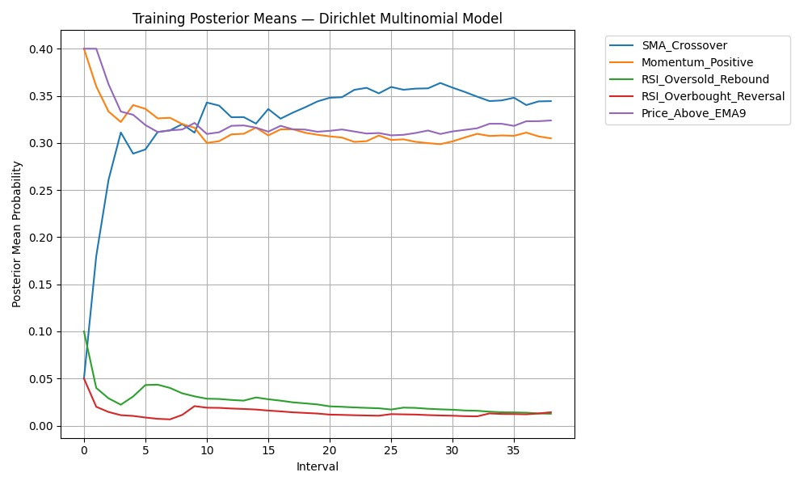
This line plot shows how the **posterior mean probabilities** of profitability for each strategy evolve over successive training intervals (each interval representing 20 trades per batch).
### Testing Data 

On the testing dataset:
- The **average profit rate** for each strategy is computed as the mean of its profit indicators.
- These testing averages are compared against the **posterior means** obtained from training.
This step checks whether the Bayesian model’s learned beliefs about each strategy’s success probability align with their actual performance on unseen data.

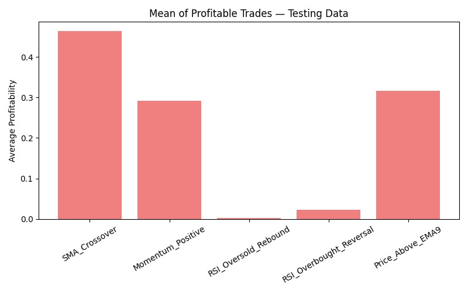

This bar chart displays the **mean profitability** of each strategy on the **testing dataset**. Each bar represents one strategy’s **average profit rate** on test data, computed as the fraction of profitable trades in the testing period.

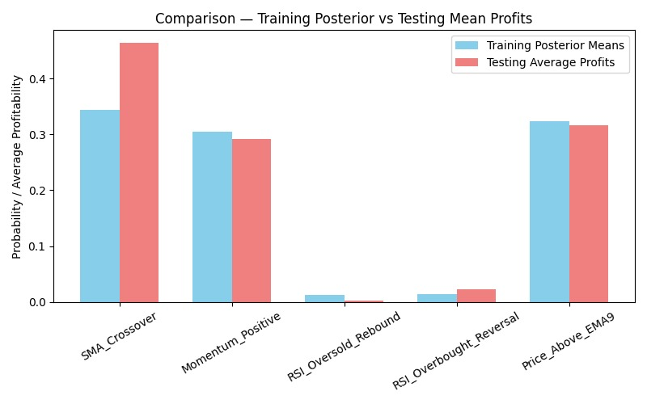This figure shows a side-by-side comparison between the **posterior mean probabilities** obtained during the training phase and the **average profitability** observed in the testing phase for each trading strategy.
For every strategy $i$:
- The **blue bar** represents the model’s estimated profitability, $\mathbb{E}[p_i \mid \text{training data}]$, derived from the Dirichlet–Multinomial posterior.
- The **red bar** represents the **empirical mean profit**, $\bar{p}_i^{\text{test}}$​, computed from unseen (testing) data.
Here, $\bar{p}_i^{\text{test}}$ denotes the **average observed profitability** of strategy $i$ across all test trades: $$\bar{p}_i^{\text{test}} = \frac{1}{n_{\text{test}}} \sum_{t=1}^{n_{\text{test}}} p_{i,t}, \quad p_{i,t} = \begin{cases} 1, & \text{if trade } t \text{ was profitable} \\ 0, & \text{otherwise.} \end{cases}$$Thus, $\bar{p}_i^{\text{test}}$​ represents how frequently a strategy yielded profits on unseen data.

Ideally, the two bars for each strategy should be close in height, indicating that the **posterior estimates** generalize well to new data. Large discrepancies suggest potential **model bias** or **instability**, such as when a strategy performs strongly during training but weakly during testing. 
In our case, the posterior estimates align closely with the observed testing profits for most strategies particularly **SMA_Crossover**, **Momentum_Positive**, and **Price_Above_EMA9** indicating that the Bayesian model provides **reasonably accurate and stable predictions** of strategy profitability on unseen data.

---
## Monte Carlo Posterior-Predictive Analysis

The Dirichlet–Multinomial model gives an analytically convenient posterior for the vector of strategy-profit probabilities $\mathbf{p}=(p_1,\dots,p_K)$. The posterior mean is useful, but it hides uncertainty and does not directly answer predictive questions such as:

> **What is the probability that strategy `SMA_Crossover` will be profitable in more than 50% of future trades?**

Computing that probability analytically from the posterior predictive distribution (PPD) is possible in simple conjugate models but becomes cumbersome for vector-valued Dirichlet–Multinomial models, so we use **Monte Carlo simulation** to approximate it.
### Algorithm
We wish to estimate the probability that the **SMA Crossover** strategy will be profitable in more than $50$% of future trades.
- **Posterior sampling:**  
    Draw samples of the profitability vector $\mathbf{p}$ repeatedly from the Dirichlet posterior $p \sim \text{Dirichlet}(\boldsymbol{\alpha}_{\text{posterior}})$
- **Predictive simulation:**  
    For each draw, extract $p_{\text{SMA}}$ and simulate the number of profitable trades in $N$ future trials:  $$X_{\text{SMA}} \sim \text{Binomial}(N, p_{\text{SMA}})$$
- **Estimate target probability:**  
    Count how many simulated futures satisfy $X_{\text{SMA}}/N > 0.5$. The Monte Carlo estimate $$\widehat{P} = \frac{1}{M}\sum_{m=1}^{M}\mathbf 1\!\left\{X_{\text{SMA}}^{(m)}/N>0.5\right\}$$approximates $\Pr(\text{SMA Crossover profitable} > 50\%)$

Running the above algorithm gives us the following output which is also evident from the graph below
```python
🔹 Estimated P(SMA_Crossover profitable > 50%) ≈ 0.0008
```
#### Why this works

- Sampling $p_{\text{SMA}}$ from the Dirichlet posterior represents uncertainty in the true profitability.
- Simulating Binomial outcomes for each $p_{\text{SMA}}$​ adds uncertainty in **future market realizations.
- Repeating the process many times approximates the full posterior-predictive distribution; the proportion of simulations above $50$ % gives the desired probability.


Graph representing the posterior distribution of the probability that an SMA (Simple Moving Average) crossover trading strategy is profitable, based on Monte Carlo simulations.

